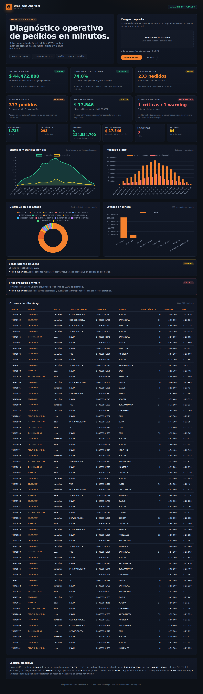

# Dropi Ops Analyzer — Diagnóstico operativo de pedidos

Reconstrucción funcional (ingeniería inversa) de la subapp **Dropi Ops Analyzer**:
sube un reporte de Dropi (XLSX o CSV) y obtén, en segundos, métricas críticas de
operación, alertas de priorización y una lectura ejecutiva.

Todo el procesamiento ocurre **en el navegador**. El archivo no se sube a ningún
servidor ni se persiste — se lee en memoria y se descarta al recargar.



---

## Cómo usarla

No requiere build ni instalación. Al ser una app 100% estática con las librerías
incluidas localmente, basta con abrir `index.html`.

```bash
# Opción 1: abrir directamente
xdg-open index.html          # Linux
open index.html              # macOS

# Opción 2: servidor local (recomendado para evitar restricciones file://)
python3 -m http.server 8080
# luego abre http://localhost:8080
```

1. Arrastra o selecciona tu reporte de Dropi (`.xlsx` o `.csv`).
2. Pulsa **Analizar archivo**.
3. Revisa KPIs, gráficos, alertas y la tabla de órdenes de alto riesgo.

Hay un reporte de ejemplo en `sample/ordenes_productos_ejemplo.csv` para probarla
sin datos reales.

---

## Qué lee del reporte (mapeo de columnas)

El parser reconoce el encabezado automáticamente y mapea múltiples variantes de
nombre a cada campo canónico (`assets/app.js` → `COLUMN_ALIASES`). No importa el
orden de las columnas ni mayúsculas/acentos.

| Campo canónico   | Encabezados aceptados (ejemplos)                                   |
|------------------|-------------------------------------------------------------------|
| `orden`          | ID, ORDEN, ID ORDEN, NUMERO ORDEN                                 |
| `estado`         | ESTATUS, ESTADO, ESTADO DEL ENVIO, STATUS                         |
| `transportadora` | TRANSPORTADORA, COURIER, OPERADOR LOGISTICO                       |
| `tracking`       | GUIA, NUMERO GUIA, TRACKING                                       |
| `ciudad`         | CIUDAD, CIUDAD DESTINO, CIUDAD DE DESTINO, MUNICIPIO              |
| `departamento`   | DEPARTAMENTO, DEPTO                                               |
| `recaudo`        | TOTAL DE LA ORDEN, VALOR RECAUDO, RECAUDO, COD, TOTAL            |
| `flete`          | PRECIO FLETE, FLETE, COSTO FLETE, VALOR FLETE                     |
| `fecha`          | FECHA, FECHA CREACION, FECHA DE CREACION                          |
| `fechaEntrega`   | FECHA ENTREGA, FECHA DE ENTREGA                                   |
| `diasTransito`   | DIAS TRANSITO, DIAS DE TRANSITO, DIAS (si no viene, se calcula)   |

Los valores monetarios aceptan formato colombiano (`$ 93.900`, `1.234,56`) y las
fechas aceptan `Date` de Excel, serial numérico o texto (`YYYY-MM-DD`, `DD/MM/YYYY`).

### Agrupación de estados

Cada estado se clasifica en un grupo lógico (`GROUP_BY_STATE`). Cualquier estado no
listado se considera **tránsito** (en movimiento):

- **entregado**: ENTREGADO
- **cancelado**: DEVOLUCION, CANCELADO, DEVUELTO, RECHAZADO, ANULADO
- **extraviado**: EXTRAVIADO, PERDIDO, SINIESTRO
- **novedad**: NOVEDAD, RECLAME EN OFICINA, EN ESPERA DE RX
- **tránsito** (resto): EN REPARTO, DESPACHADA, EN BODEGA *, INTENTO DE ENTREGA,
  TELEMERCADEO, EN PROCESAMIENTO, EN REEXPEDICION, CITA PROGRAMADA, …

---

## Fórmulas (derivadas por ingeniería inversa)

Con `N` = total de órdenes del reporte:

| Métrica                    | Fórmula                                                        |
|----------------------------|---------------------------------------------------------------|
| Cumplimiento de entrega    | `entregadas / N`                                              |
| % en tránsito              | `en_tránsito / N`                                            |
| Tasa de cancelación        | `canceladas / N`                                             |
| Fuga operativa             | `canceladas + extraviadas`                                   |
| Backlog sensible           | `en_tránsito + novedad`                                      |
| Recaudo potencial          | `Σ recaudo` (todas las órdenes)                             |
| Recaudo cobrado            | `Σ recaudo` de órdenes **entregadas**                       |
| Dinero en riesgo (pendiente)| `recaudo_potencial − recaudo_cobrado`                       |
| % pendiente                | `pendiente / recaudo_potencial`                             |
| Ticket promedio            | `recaudo_potencial / nº órdenes con recaudo > 0`            |
| Flete promedio             | `Σ flete / nº órdenes con flete > 0`                        |
| Presión de flete           | `flete_promedio / ticket_promedio`                          |
| Días de tránsito promedio  | media de `días` en órdenes en tránsito                      |
| Mayor impacto de fuga      | ciudad con más órdenes canceladas/extraviadas              |
| Mayor recaudo pendiente    | transportadora con mayor `Σ recaudo` no entregado          |

### Series temporales (por `fecha` del reporte)

- **Entregas y tránsito por día**: conteo diario de entregadas vs. en tránsito.
- **Recaudo diario**: `Σ recaudo` cobrado (entregadas) vs. pendiente (resto) por día.
- **Distribución por estado**: conteo de órdenes por estado (donut).
- **Estados en dinero**: `Σ recaudo` (COD) por estado (top 8).

### Umbrales de badges y alertas (`TH` en `app.js`)

| Indicador           | Verde        | Amarillo         | Rojo         |
|---------------------|--------------|------------------|--------------|
| Dinero en riesgo    | < 30%        | 30–50%           | > 50%        |
| Cumplimiento        | ≥ 70%        | 60–70%           | < 60%        |
| Fuga operativa      | < 8%         | 8–15%            | > 15%        |
| Presión de flete    | ≤ 18%        | 18–25%           | > 25%        |

Alertas generadas automáticamente:

- **Cancelaciones elevadas** — cancelación ≥ 8% (`warning`) / ≥ 15% (`critical`).
- **Flete promedio anómalo** — algún estado con flete medio > 180% del global (`critical`).
- **Órdenes extraviadas** — si hay extravíos (`critical`).
- **Cumplimiento por debajo del umbral** — cumplimiento < 60% (`critical`).
- **Deterioro de tránsito** — días de tránsito promedio > 4 (`warning`).

> Los umbrales están centralizados en el objeto `TH` de `assets/app.js` para
> ajustarlos fácilmente a la operación real.

### Decisiones accionables (`buildDecisions` en `app.js`)

Sobre el diagnóstico, la app añade una sección **Decisiones accionables** que
traduce las métricas en un plan priorizado con el dinero en juego:

- **Dinero recuperable** = recaudo en tránsito + novedad (se cobra si se entrega).
- **Dinero en fuga** = recaudo en cancelado + extraviado (no se cobrará).
- **Acciones priorizadas** por urgencia (rojo → naranja → amarillo) y luego por
  impacto en pesos. Cada acción trae su detalle y el paso concreto a ejecutar:

| Acción | Se dispara cuando | Impacto que muestra |
|---|---|---|
| **RECLAMAR** extravíos | hay órdenes extraviadas | recaudo extraviado (+ flete a bloquear) |
| **GESTIONAR** novedades | hay órdenes en novedad | recaudo retenido en novedad |
| **DESTRABAR** tránsito | hay órdenes en tránsito | recaudo por cobrar en ruta |
| **AUDITAR** cancelaciones | cancelación ≥ 8% | recaudo cancelado |
| **OPTIMIZAR** flete | presión de flete > 18% | — |
| **REBALANCEAR** carriers | cumplimiento < 70% | pendiente del carrier más expuesto |

La misma lógica se imprime en el CLI de la skill (bloque *DECISIONES ACCIONABLES*).

---

## Validación

Los valores de referencia de la app original se reproducen con el reporte de
ejemplo (2.345 órdenes):

| Métrica              | App original | Este clon (ejemplo) |
|----------------------|--------------|---------------------|
| Cumplimiento         | 74.0%        | 74.0%               |
| Tasa de cancelación  | 9.9%         | 9.9%                |
| Dinero en riesgo     | $ 44.566.275 | $ 44.472.800        |
| % pendiente          | 26.1%        | 26.3%               |
| Ticket promedio      | $ 72.843     | $ 72.080            |
| Presión de flete     | 24.3%        | 24.3%               |
| Alertas              | 1 crítica / 1 warning | 1 crítica / 1 warning |

El motor de cálculo (`normalizeRows`, `computeMetrics`, `computeSeries`,
`buildAlerts`) se exporta para pruebas en Node cuando el módulo se carga fuera del
navegador.

Para regenerar el reporte de ejemplo:

```bash
node sample/generate_sample.js
```

---

## Estructura

```
index.html                 # UI (hero, carga, KPIs, gráficos, tabla, lectura ejecutiva)
assets/
  styles.css               # Tema oscuro con acento naranja
  app.js                   # Motor: parseo, métricas, alertas y render
  vendor/
    xlsx.full.min.js        # SheetJS (lectura XLSX/CSV) — MIT
    chart.umd.min.js        # Chart.js (gráficos) — MIT
sample/
  generate_sample.js        # Generador de reporte de prueba
  ordenes_productos_ejemplo.csv
```

---

## Notas de la reconstrucción

- Reconstruida a partir del comportamiento observado de la subapp (interfaz,
  KPIs y series). Los nombres exactos de estados y las agrupaciones se basan en el
  export estándar de Dropi (Colombia) y son configurables.
- Si tu export usa encabezados distintos a los listados, añádelos a
  `COLUMN_ALIASES` en `assets/app.js`.
- Librerías incluidas localmente (SheetJS y Chart.js, ambas MIT) para que funcione
  sin conexión y sin depender de CDNs.
